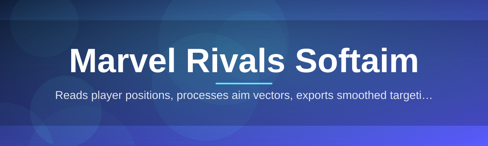
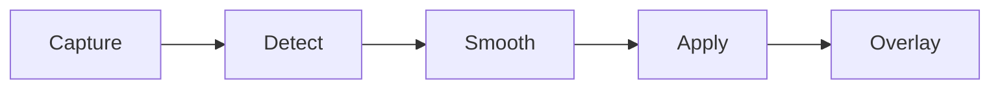

# mrivals-aim-assistant 🎯🕸️

  

*A precision-tuned aim companion built for Marvel Rivals — smoother tracking, calmer hands, better rounds.*

  

## 🌌 Overview

**mrivals-aim-assistant** is a community-driven aim assistance layer purpose-built for Marvel Rivals. Instead of treating aim as an all-or-nothing switch, it approaches targeting like a tuning problem — smoothing micro-corrections, compensating for hero-specific projectile arcs, and giving you a configurable assist curve that feels like an extension of your own muscle memory rather than a replacement for it.

Marvel Rivals' roster is wild in the best way: hitscan snipers, arcing projectile bruisers, hyper-mobile flankers, and healers who need to track allies just as precisely as enemies track them. A single generic softaim profile falls apart across that variety. This project exists because the community kept asking for something that adapts per-hero, respects different playstyles, and doesn't feel like it's flying the mouse for you.

It's built for players who want to spend less time fighting sensitivity curves and more time learning positioning, cooldown timing, and team fight rhythm — with the aim layer quietly smoothing the last 10% instead of doing 100% of the work. Whether you're a controller-on-keyboard purist or someone who just wants consistent crosshair placement, this tool aims (pun intended) to meet you where you are.

> [!NOTE]
> This is a standalone Windows tool. It reads your input and screen state locally — nothing is uploaded, nothing phones home.

---

## 🧬 What It Actually Does

**Adaptive Smoothing Curve** — dynamically eases your mouse movement toward a target based on distance, velocity, and hero weapon type instead of applying a flat multiplier.

**Hero-Aware Profiles** — separate tuning presets for hitscan duelists, projectile strategists, and melee vanguards, because a Hawkeye arrow and a Magik blade shouldn't behave the same way.

**FOV-Respecting Targeting** — assist strength tapers off outside a configurable field-of-view cone so it never fights you for control of the camera.

**Recoil-Conscious Tracking** — accounts for weapon-specific pattern drift so tracking assist and recoil don't cancel each other out mid-fight.

**Low-Latency Input Loop** — runs on a lightweight polling loop tuned for minimal frame impact, so your FPS stays yours.

**Live Overlay HUD** — a translucent, draggable overlay shows current profile, sensitivity multiplier, and assist strength without opening a settings menu mid-match.

**One-Key Toggle** — enable, disable, or cycle profiles instantly with a single rebindable hotkey, no alt-tabbing required.

**Config Profiles & Presets** — save multiple named setups (per-hero, per-mode) and swap between them in seconds.

> [!TIP]
> Start with the **Balanced** preset before building a custom curve. Most players overtune smoothing on day one.

---

## 🚀 Getting Started

1. **Visit the landing page** using the download button above.

2. **Download the latest build** — it ships as a single portable executable, no installer wizard.

3. **Run it once** as Administrator so it can read input devices correctly.

4. **Open the overlay**, pick a hero profile, and drop into a match to fine-tune sensitivity live.

> [!IMPORTANT]
> Always download from the official landing page linked in this README. Third-party mirrors are not maintained by this project and may be outdated or altered.

---

## 🖥️ System Requirements

| Component | Minimum |
|---|---|
| OS | Windows 10 (64-bit) |
| OS | Windows 11 (64-bit) — recommended |
| Dependencies | None — fully standalone |
| Disk Space | Under 50 MB |
| Permissions | Administrator (for input hooking) |

<b>Why does it need Administrator rights?</b>

The assist loop reads raw input events at a level that Windows restricts to elevated processes. This is the same permission tier most competitive overlay and input-remapping tools require — it's not doing anything invasive, just requesting the access tier the OS demands for that read.

---

## 🧠 How It Works

The pipeline is intentionally simple — fewer moving parts means fewer things to break mid-match.

1. **Capture** — the tool reads screen and input state on a tight local loop.

2. **Detect** — target candidates are evaluated against your active hero profile.

3. **Smooth** — the adaptive curve calculates a corrected path, not a snap.

4. **Apply** — the correction is blended into your existing mouse movement.

5. **Render** — the overlay reflects live status so you always know what's active.

> [!WARNING]
> Running multiple overlay or input-tuning tools simultaneously can cause conflicts. Disable other input utilities before launching this one.

---

## 🛟 Troubleshooting

**Q: The overlay won't appear after launch.**
Run the executable as Administrator — the overlay renderer needs elevated permissions to draw over the game window.

**Q: My sensitivity feels inconsistent between heroes.**
That's expected if you're using one profile for everyone. Switch to hero-specific profiles under the preset menu.

**Q: The hotkey to toggle assist isn't responding.**
Check for a rebind conflict with in-game keybinds or another overlay tool listening on the same key.

**Q: Frame rate dipped after enabling the overlay.**
Lower the overlay's refresh rate in Settings — the HUD polling interval is adjustable independently of the assist loop.

**Q: Windows Defender flagged the executable.**
This is common for unsigned indie tools that hook input. Verify you downloaded from the official landing page and allow it through if you trust the source.

**Q: Can I use this on Marvel Rivals custom or ranked modes?**
Behavior across modes depends on the game's own anti-tamper policies — always check current community guidance before ranked play.

---

## 🎨 UI / UX Details

**Themes** — Dark, Light, and a high-contrast Marvel-inspired accent theme.

**Overlay** — draggable, resizable, and can be pinned to any screen corner.

| Shortcut | Action |
|---|---|
| `F1` | Toggle assist on/off |
| `F2` | Cycle hero profile |
| `F3` | Open/close overlay |
| `F4` | Open settings panel |
| `Ctrl+S` | Save current profile |

**Settings persistence** — all profiles and hotkeys save automatically to a local config file, no cloud account required.

---

## 🤝 Contributing & Community

We label beginner-friendly issues as **good first issue** — if you're new to open source, that's your entry point.

- **Report bugs** with clear repro steps and your hero profile settings.

- **Suggest presets** for heroes that feel undertuned.

- **Improve docs** — clarity fixes are always welcome, even small ones.

- **Review PRs** — a second pair of eyes speeds everything up.

> [!TIP]
> Before opening a PR, check open issues tagged `good-first-issue` — they're scoped specifically for new contributors.

  

---

## 📜 License

Released under the [MIT License](LICENSE) — 2026.

---

## ⚖️ Disclaimer

> This project is an independent, fan-made tool and is not affiliated with, endorsed by, or associated with Marvel, NetEase Games, or the official Marvel Rivals development team. Use in online matches is at your own discretion and risk — always review the current terms of service for Marvel Rivals before use.

